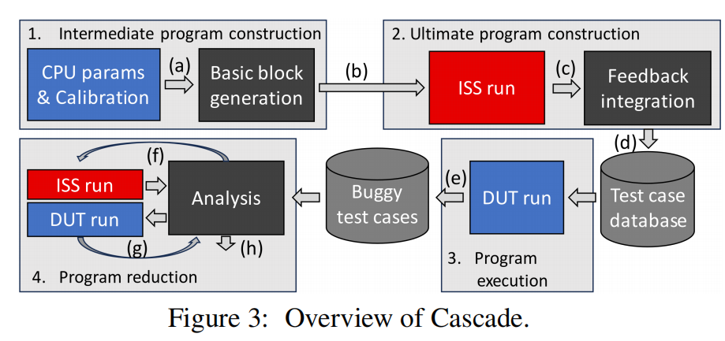
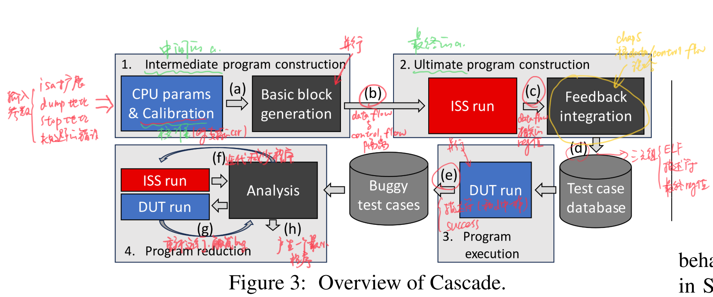

## 摘要
- 提出了cascade，能生成随机化、相互依赖的指令流
- 长程序更有效
## 1.简介
- cpu fuzzing程序
- bug检测：简单说了下difftest的思路，然后说他不好，只在结束的时候对比，不能监控中间状态
- cascade引入：我们的是随机riscv程序生成器，引入了非对称isa预模拟。
- 三个特性：程序很长，提高性能；探索不寻常的数据和控制流；通过高度关联的程序，让程序跑不到最后，就直接崩了，就不用像difftest那种有运行时开销
- 成果：薄纱
- 自动程序剪枝器：会迭代，触发bug后会有挂起、错误的值、exceptions、decode issue、性能计数器不精确
## 2.背景
### 2.1 硬件形式化验证
计算成本高、人工成本高
### 2.2 软件fuzzing
- fuzzer需要一个策略生成测试用例
- 依赖于某种形式的coverage feedback、静态/动态taint分析、语法
- bug检测：crash、sanitizer
### 2.3 硬件fuzzing
- 目前sanitizer程序仅限于sv assertion
- crash法是在程序末尾用store指令dump寄存器组值，然后和ISS比对
- diff法是。。。
## 3.动机和挑战（文章的TODOS）
### 3.1 发现
- fuzzing代码跑不完就挂了
-  大多数执行的指令是开销，并不是fuzzing
### 3.2 挑战
- 怎么生成高prevalence的程序：chap4说了一种新的程序构造法，
- 怎么生成数据流和控制流之间高度依赖的程序：chap5，非对称isa预模拟用于将高度随机化的数据流与中间程序的控制流混合；cascade能使用ISS生成有效的程序，而不是使用ISS进行差分模糊化。
- 如何从一个复杂的程序中提取并解释bug：chap6，寻找最小指令数的迭代程序剪枝器
## 4.设计
### 4.1Cascade概览

程序构造（步骤1和2）与其他步骤分离，因此同一程序可以在同一CPU的多个版本上执行，或者在具有兼容扩展的CPU上执行

- 中间程序构造：图3中，Cascade将所支持的isa扩展、转储寄存器和停止RTL模拟的地址、要规避的已知错误的描述作为输入，并从简短的校准阶段（不到一秒）开始，以评估一些CPU参数，如所支持的CSR位（a）。因此，生成程序是一项并行任务。级联首先生成中间程序作为基本块的序列，其中控制流与数据流隔离（B）。
- ISS然后执行整个中间程序一次，以收集寄存器（c）的数据流相关值。Cascade使用这些信息将数据流与控制流混合在一起，如第5节所述，以生成最终的程序（d）。它被定义为三元组（ELF文件、描述符和预期的最终寄存器值（可选）），其中描述符是允许重新生成相同程序的短标识符。
- 程序执行。程序的执行也是一个并行任务。每个最终程序都是在受试的模拟设计上独立执行的。输出（e）是一对（描述符，成功）。描述符与（d）中的描述符相同。如果程序成功终止，或者如果转储的寄存器值匹配，则触发成功标志。
- 程序剪枝。程序简化阶段将导致执行失败的测试描述符作为输入，并生成简化的程序，该简化的程序保留了错误行为，同时降低了程序复杂性，如第6节所述。分析包括迭代地减少程序（f），并重新运行它，以检查是否仍然触发了bug（g），并产生一个易于理解的最小程序（h），如第6节所述。

### 4.2中间程序构造
解释Cascade生成的程序的结构 -> Cascade如何选择指令以形成基本块 -> 讨论了保证程序结构可靠性的内存管理机制
#### 4.2.1程序结构
1.基本块：由零个或多个不影响控制流的指令组成，后面跟着一个影响控制流的指令；Cascade将程序构造为基本块序列，其中基本块的最后一条指令转向下一个基本块。
2.初始基本块：所有程序以初始基本块起始
3.结束基本块：所有程序以结束基本块结束，作为最后一个基本块；可以选择性地转储寄存器值，并发送一个信号来指示程序已经结束。
#### 4.2.2基本块生成
1.控制流行为：
- 不改变给定程序的控制流的指令称为静止指令，其他的称为跳跃指令。
- 根据寄存器值而可能是静止的或跳跃的指令，或无条件跳跃但其目的地取决于寄存器值的指令定义为cf-ambiguous
- eg. beq和lw(会出现放存错误而发生跳转)是cf-ambiguous

2.挑选指令：
Cascade会先选择类别，然后再选择特定指令，以类别方式挑选指令。两者都是以一定的概率随机选择的，这些概率在程序之间是变化的。当选择一个cf-ambiguous指令时，Cascade会立即选择它是静止还是跳跃。Cascade通过向最近用作输出的寄存器设定更高的概率，来表现这种对操作数选择的偏好。
支持复杂的FPU操作和CSR交互。
#### 4.2.3内存管理

## 5.最终程序构建(Cascade如何使用ISS反馈来entangle数据和控制流)